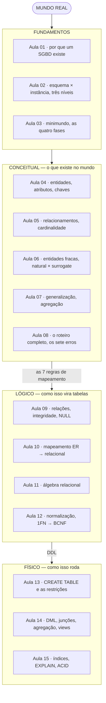
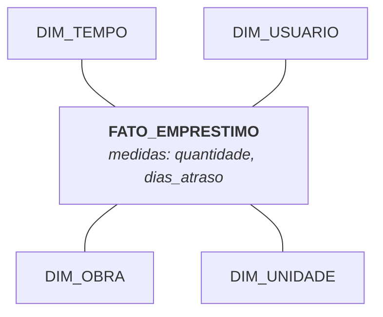

# Aula 16 — Revisão e Próximos Passos

> 🎯 Objetivos: revisitar o curso inteiro num único fio condutor, reconhecer quando o modelo relacional **não** é a resposta e escolher o próximo passo de estudo.

## 1. O mapa do curso em uma tela



**A frase que resume o curso:** cada nível é uma tradução do anterior, e **nenhuma tradução conserta um erro do nível de cima**. Um DER errado vira um esquema errado, que vira um banco errado — rápido e íntegro, defendendo com rigor uma informação que não corresponde ao mundo.

## 2. O mesmo minimundo, nas quatro fases

Uma única frase do enunciado da Biblioteca, atravessando o curso inteiro:

> *"Uma obra tem vários exemplares físicos. É o exemplar que é emprestado, nunca a obra."*

| Fase | O que essa frase virou |
|---|---|
| **Requisitos** | A pergunta *"vocês emprestam o título ou o volume físico?"* — e a resposta que mudou o modelo |
| **Conceitual** | Duas entidades, `OBRA` e `EXEMPLAR`, num 1:N com `(0,N)` e `(1,1)` |
| **Lógico** | `EXEMPLAR(tombo, isbn, ...)` com `isbn → OBRA(isbn)`, pela Regra 3 |
| **Físico** | `FOREIGN KEY (isbn) REFERENCES obra (isbn) ON DELETE RESTRICT` + índice em `isbn` |
| **Consulta** | `SELECT o.titulo FROM emprestimo e JOIN exemplar x ON ... JOIN obra o ON ...` |

E o custo de ter errado logo na primeira linha: ligar `EMPRESTIMO` direto a `OBRA` produziria um banco que **funciona perfeitamente** e é incapaz de dizer qual livro físico está com quem. Nenhuma consulta engenhosa recupera isso.

> 📏 O que levar do curso, se for para levar uma coisa só: **modelar é decidir hoje quais perguntas serão possíveis amanhã.**

## 3. Modelagem dimensional: quando a pergunta é outra

Tudo que você aprendeu otimiza para **transações**: muitas escritas pequenas, integridade rigorosa, redundância zero. Isso chama-se **OLTP** (*online transaction processing*), e é o que faz um sistema funcionar.

Mas quando a pergunta é *"qual a evolução de empréstimos por curso, por mês, nos últimos cinco anos?"*, o esquema normalizado é o pior formato possível: a consulta precisa de sete junções e varre milhões de linhas.

Para análise (**OLAP**) usa-se a **modelagem dimensional**, e ela inverte quase tudo:



- **Tabela fato** — o evento medido, com as métricas numéricas. Cresce sem parar;
- **Tabelas dimensão** — o contexto pelo qual se filtra e agrupa. Pequenas e **deliberadamente desnormalizadas**;
- O desenho chama-se **esquema estrela** (*star schema*).

| | OLTP (o curso) | OLAP (dimensional) |
|---|---|---|
| Otimiza | Escrita, integridade | Leitura, agregação |
| Normalização | 3FN/BCNF | Desnormalizado de propósito |
| Consulta típica | "os dados do empréstimo 4417" | "total por mês por curso, 5 anos" |
| Redundância | Erro | Escolha |

> 💡 Não são modelos concorrentes: uma organização tem os **dois**. O sistema roda em OLTP, e os dados são copiados periodicamente para um *data warehouse* dimensional. E note: **você só pode desnormalizar de propósito depois de saber normalizar.**

## 4. NoSQL: quando o relacional não é a resposta

*NoSQL* reúne bancos que abrem mão de alguma garantia do relacional em troca de escala ou flexibilidade:

| Família | Estrutura | Bom para | Exemplos |
|---|---|---|---|
| **Documento** | JSON aninhado, sem esquema fixo | Dados variáveis, catálogos heterogêneos | MongoDB, CouchDB |
| **Chave-valor** | Um valor por chave | Cache, sessão, contador | Redis, DynamoDB |
| **Coluna larga** | Colunas por linha, distribuído | Volume enorme, escrita intensa | Cassandra, HBase |
| **Grafo** | Nós e arestas | Relações profundas: redes sociais, rotas, fraude | Neo4j |

**Use relacional quando** — os dados têm estrutura estável, a integridade importa, há relacionamentos entre entidades, você precisa de consultas ad hoc e transações ACID. Ou seja: quase sempre, na maioria dos sistemas de informação.

**Considere NoSQL quando** — a estrutura varia de registro para registro, o volume ultrapassa o que uma máquina comporta, o padrão de acesso é sempre o mesmo e conhecido de antemão, ou o problema é genuinamente de grafo.

> ⚠️ **"Sem esquema" não significa sem modelagem.** Num banco de documentos, o esquema deixa de ser declarado no banco e passa a ser mantido na aplicação — por acordo, não por verificação. Os quatro pecados da Aula 01 voltam todos, e agora sem ninguém defendendo. **A modelagem que você aprendeu vale igual; o que muda é quem cobra a conta.**

E um detalhe que é anedota útil: o modelo de grafo é o modelo de rede dos anos 70 (Aula 02, seção 6) de volta, com hardware melhor e um problema real para resolver. Poucas ideias em computação são realmente novas.

## 5. ORM e a impedância objeto-relacional

Quem programa orientado a objetos (o [curso de Java](https://github.com/jreluiz/curso-java-poo), por exemplo) trabalha com objetos, herança e referências. O banco trabalha com tabelas, chaves e junções. Os dois modelos **não se correspondem**, e a diferença tem nome: **impedância objeto-relacional**.

| Em objetos | No relacional | O atrito |
|---|---|---|
| Herança (`class Aluno extends Usuario`) | Não existe | As quatro opções da Aula 10, seção 9 |
| Referência (`pedido.getCliente()`) | Chave estrangeira | Uma navegação = uma junção |
| Coleção (`List<Item> itens`) | Tabela com FK | Carregar quando? Tudo de uma vez ou sob demanda? |
| Identidade (`==` em memória) | Chave primária | Dois objetos, mesma linha |

Um **ORM** (Hibernate, JPA, SQLAlchemy, Entity Framework) automatiza essa tradução. Ele economiza muito código repetitivo — e esconde o SQL que está sendo gerado, o que produz o problema mais comum de desempenho em aplicações modernas: **o problema N+1**, em que listar 100 pedidos com seus clientes dispara 101 consultas em vez de 1 junção.

> 💡 **A razão de fundo para ter feito este curso antes de usar um ORM:** o ORM gera SQL, e quem não lê SQL não percebe quando o SQL gerado é ruim. Modelar bem e saber ler um `EXPLAIN` (Aula 15) é o que separa quem usa a ferramenta de quem é usado por ela.

## 6. Para onde ir

**Aprofundar em bancos de dados**
- **SQL avançado** — funções de janela (`OVER`, `PARTITION BY`), CTEs recursivas (`WITH RECURSIVE`), `GROUPING SETS`. É o próximo salto de produtividade real;
- **Administração (DBA)** — configuração, replicação, particionamento, ajuste fino, alta disponibilidade;
- **Desempenho** — leia [Use The Index, Luke!](https://use-the-index-luke.com/pt/) inteiro. É curto e muda a forma como você escreve consultas.

**Aplicar o que você já sabe**
- **Uma linguagem + um banco** — conecte um programa ao PostgreSQL (JDBC em Java, `psycopg` em Python) e veja o modelo virando sistema;
- **Migrações versionadas** — Flyway, Liquibase, ou o mecanismo do seu framework. Esquema de banco é código e merece Git, exatamente como o resto;
- **Modelagem dimensional** — se o interesse for dados e análise, este é o caminho natural.

**Praticar modelagem, que é o que enferruja**
- Modele sistemas que você usa: o aplicativo do banco, a plataforma de streaming, o sistema da faculdade. Dez minutos num guardanapo, sem ferramenta;
- Pegue um modelo pronto de um projeto de código aberto e **critique-o** — encontrar o erro alheio ensina mais rápido que acertar sozinho;
- Refaça os [minimundos](../../recursos/minimundos.md) ⭐⭐⭐⭐ do catálogo. Eles foram escritos para doer.

## 7. Autoavaliação

Sem consultar nada, responda em voz alta. O que travar, revisite a aula indicada:

- [ ] Explicar a diferença entre esquema e instância *(Aula 02)*;
- [ ] Dizer o que é independência lógica e dar um exemplo *(Aula 02)*;
- [ ] Listar as quatro fases do projeto e o produto de cada uma *(Aula 03)*;
- [ ] Classificar um atributo nos quatro eixos *(Aula 04)*;
- [ ] Determinar cardinalidade e participação sem hesitar, nas duas direções *(Aula 05)*;
- [ ] Explicar por que `ITEM_PEDIDO` é fraca e `PEDIDO` não é *(Aula 06)*;
- [ ] Dizer quando **não** especializar *(Aula 07)*;
- [ ] Modelar um minimundo novo do zero, com regras de negócio escritas *(Aula 08)*;
- [ ] Nomear as quatro restrições de integridade *(Aula 09)*;
- [ ] Aplicar as sete regras de mapeamento de cabeça *(Aula 10)*;
- [ ] Escrever uma consulta em álgebra relacional e traduzi-la para SQL *(Aula 11)*;
- [ ] Explicar 2FN e 3FN com um exemplo próprio, e verificar perda numa decomposição *(Aula 12)*;
- [ ] Escrever um `CREATE TABLE` com FK, `CHECK` e ação referencial justificada *(Aula 13)*;
- [ ] Escrever uma consulta com três junções, `GROUP BY` e `HAVING` *(Aula 14)*;
- [ ] Dizer quando criar um índice e qual o custo de criar demais *(Aula 15)*;
- [ ] Explicar ACID e o que uma transação garante *(Aula 15)*.

## 🏋️ Exercícios da aula

Na pasta `aula-16/` do seu repositório:

1. **`ex01.md`** — responda a autoavaliação da seção 7 **por escrito**, uma frase por item. Marque com 🔴 os que você não respondeu com segurança e escreva o plano de revisão: qual aula, qual seção, qual exercício refazer;
2. **`ex02.md`** — pegue o **primeiro modelo** que você fez no curso (`ex01.md` da Aula 04) e refaça-o com tudo que aprendeu. Entregue os dois lado a lado e escreva uma análise: o que você errava, o que passou a ver, e qual conceito específico causou a maior mudança;
3. **`ex03.md`** — para cada caso, escolha **relacional** ou **NoSQL** (dizendo qual família) e justifique em três linhas: (a) sistema acadêmico de uma universidade; (b) carrinho de compras de um e-commerce, descartado em 30 minutos; (c) catálogo de produtos onde cada categoria tem atributos completamente diferentes; (d) rede social com sugestão de "amigos de amigos"; (e) sistema de folha de pagamento; (f) coleta de leituras de 50 mil sensores por segundo;
4. **`ex04.md`** — modele em **esquema estrela** o mesmo domínio do seu projeto final: escolha o fato, as métricas e três dimensões. Depois escreva: (a) uma pergunta analítica que o estrela responde facilmente e o modelo normalizado responderia com dificuldade; (b) uma operação transacional que o estrela faria mal;
5. **Desafio 🌶️ `ex05.md`** — escolha um sistema que você usa todo dia e que **não** foi modelado no curso. Em no máximo duas páginas: minimundo em três parágrafos, DER em Mermaid, esquema relacional, uma análise de normalização, e **cinco perguntas** que o seu modelo consegue responder. Sem consultar as aulas — é o teste real de que o conteúdo virou seu.

## 🧠 Revisão

[8 questões de múltipla escolha](revisao/README.md) — a última do curso, cobrindo os quatro blocos. Responda sem consultar; depois volte às seções indicadas.

## ✅ Entrega

```bash
git add aula-16/
git commit -m "Resolve exercícios da aula 16 (revisão e próximos passos)"
git push
```

---

⬅️ [Aula 15](../aula-15-projeto-fisico-transacoes/README.md) | 🏠 [Início do curso](../../README.md)

🏁 **Fim do curso.** Você entrou sabendo que dados ficam guardados em algum lugar e sai capaz de ler um texto em português e devolver um banco de dados íntegro, normalizado e defensável — que é uma habilidade que não expira e não depende de linguagem, framework ou moda. O [projeto final](../../projetos/projeto-final.md) é a prova disso. Bom trabalho. 🙂
