<!-- _class: capa -->

<div class="emoji">🎓</div>

# Revisão e Próximos Passos

## Aula 16 · Bloco 4 — SQL e Projeto Físico

<div class="meta">O curso inteiro num fio condutor</div>

---

## 🎯 Nesta aula

1. O **mapa do curso**
2. O mesmo minimundo, nas **quatro fases**
3. **Modelagem dimensional** — quando a pergunta é outra
4. **NoSQL** — quando o relacional não é a resposta
5. **ORM** e para onde ir

---

## O mesmo minimundo, nas quatro fases

```
REQUISITOS   "o aluno pega emprestado um exemplar, por 7 dias"
     ↓
CONCEITUAL   USUARIO ──realiza──< EMPRESTIMO >──é objeto de── EXEMPLAR
     ↓
LÓGICO       EMPRESTIMO(id, matricula↗, cod_obra↗, num_exemplar↗, datas)
     ↓
FÍSICO       CREATE TABLE emprestimo (...);  + índice em data_prevista
```

Quatro representações da **mesma frase**. Cada seta foi uma aula.

---

<!-- _class: lead -->

## 📏 Se for para levar uma coisa só

# Modelar é decidir hoje quais perguntas serão possíveis amanhã.

Todo o resto do curso é técnica
a serviço dessa frase.

---

<!-- _class: diagrama -->

## Modelagem dimensional: quando a pergunta é outra



---

## Star schema

O modelo relacional normalizado é ótimo para **operação**: cadastrar, emprestar, devolver.

Para **análise** — *"faturamento por região por trimestre"* — ele cobra junções demais.

A modelagem dimensional inverte a prioridade: uma tabela **fato** no centro, cercada de tabelas **dimensão** desnormalizadas.

> 💡 É desnormalização **de propósito e por projeto** — o caso legítimo da aula 12.

---

<!-- _class: diagrama -->

## NoSQL: quando o relacional não é a resposta



---

<!-- _class: tabela-densa -->

## As quatro famílias NoSQL

| Família | Guarda | Bom para |
|---|---|---|
| **Documento** | JSON aninhado | estrutura variável por registro |
| **Chave-valor** | par simples | cache, sessão |
| **Coluna larga** | colunas esparsas | volume enorme, escrita intensa |
| **Grafo** | nós e arestas | relações profundas: rede social, rota |

> ⚠️ NoSQL troca **garantias** por escala e flexibilidade. Sem esquema, a validação que o banco fazia por você passa a ser sua.

---

## ORM e a impedância objeto-relacional

Objetos têm **herança**, **identidade** e **navegação por referência**.

Tabelas têm **junção por valor** e nada disso.

O ORM (Hibernate, JPA, Prisma) faz a ponte — e faz bem, até a hora em que esconde de você uma consulta que faz 400 idas ao banco.

> 💡 **Quem entende modelagem usa ORM melhor.** Você agora sabe ler o SQL que ele gera — e reconhecer quando ele está errado.

---

<!-- _class: lista-limpa -->

## Para onde ir

- 🐘 **SQL avançado** — CTE, funções de janela, `EXPLAIN` a fundo;
- ⚙️ **Administração** — replicação, tuning, alta disponibilidade;
- 📊 **Data warehouse e BI** — a modelagem dimensional levada a sério;
- 🌐 **NoSQL na prática** — MongoDB ou Neo4j, num projeto real;
- 🔗 **ORM** — na linguagem que você já programa.

---

<!-- _class: lead -->

## 💡 O caminho natural desta trilha

Você fez Git, VS Code, JavaScript,
Java com POO — e agora modelagem.

Junte tudo: um **sistema em Java**
que persiste num **PostgreSQL**,
versionado no **GitHub**.

É exatamente o que se pede num estágio.

---

<!-- _class: checkpoint -->

## 🏋️ Exercícios da aula

Na pasta `aula-16/`:

1. **`ex01.md`** — o seu minimundo nas quatro fases, numa página só;
2. **`ex02.md`** — modele um star schema para uma pergunta analítica do seu domínio;
3. **`ex03.md`** — um caso em que NoSQL seria melhor, e **por quê**;
4. **`ex04.md`** — autoavaliação: os três assuntos em que você menos confia;
5. **Desafio 🌶️ `ex05.md`** — pegue um sistema que você usa e faça engenharia reversa do modelo dele.

---

<!-- _class: lead -->

## 🎓 Fim do curso

Você começou com uma planilha que dava certo
até dar errado.

Termina com um banco modelado, normalizado,
implementado e consultado —
e com o vocabulário para defender cada decisão.

**Modelagem é a decisão que não tem hotfix.**
