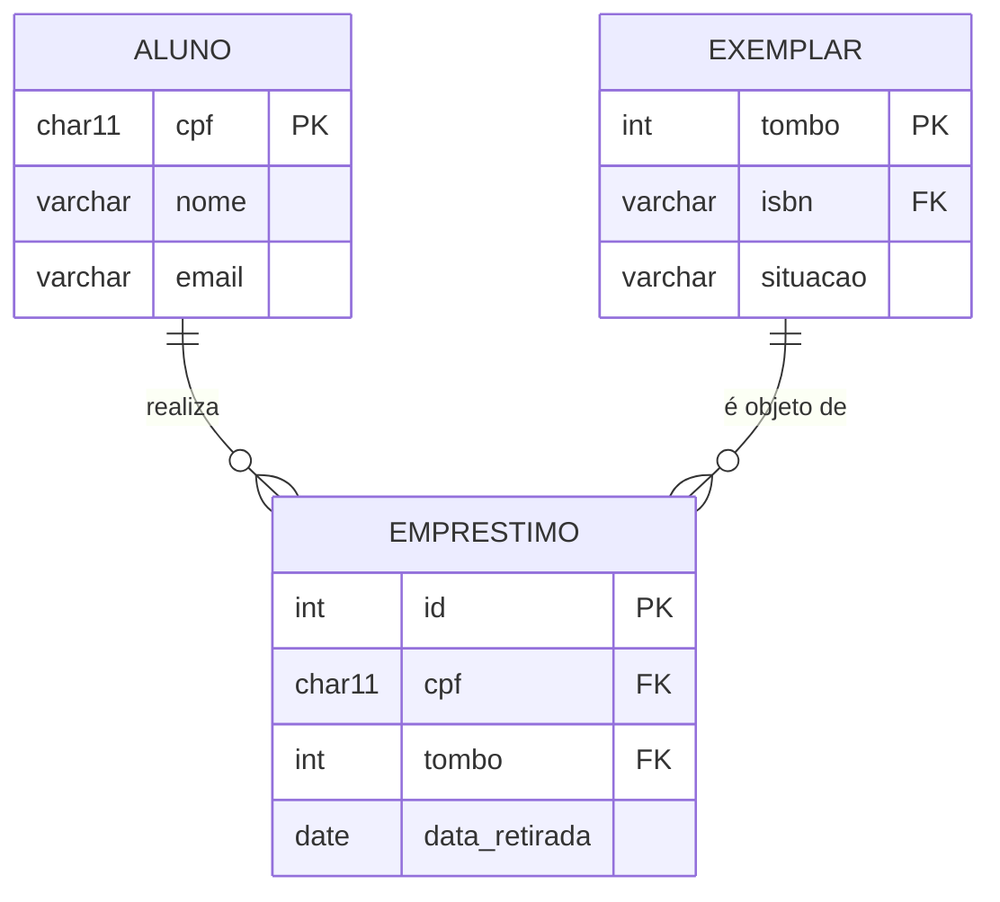
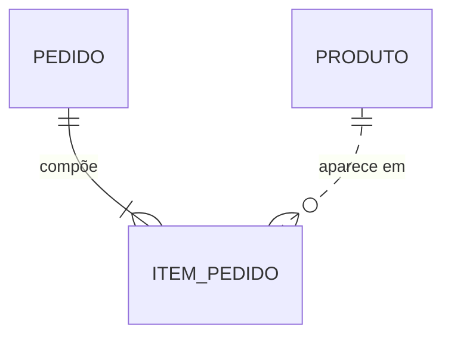
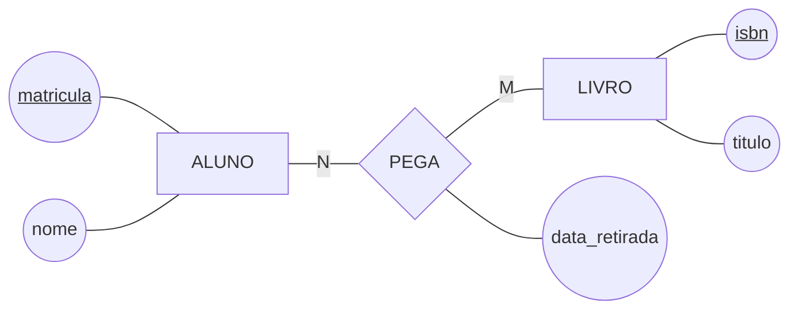

# 📐 Desenhando o DER em Mermaid

Um mesmo modelo pode ser desenhado de várias formas. **Este curso usa uma só: Mermaid `erDiagram`.**

O motivo é prático. O GitHub renderiza sozinho, é texto puro (versiona e faz *diff* de verdade), cabe dentro de um Pull Request e é uma variante da notação **pé-de-galinha** (*crow's foot*), que é a que você vai encontrar em toda ferramenta de mercado.

> 📖 O livro-base desenha em **Chen** — losangos e elipses. Você não precisa desenhar em Chen neste curso, mas precisa **ler**. A seção 5 tem a meia página que basta para isso.

---

## 1. O primeiro diagrama

Duas tabelas ligadas, com seus atributos. Isto é o que você escreve:

````markdown

````

E isto é o que o GitHub mostra:


Três coisas para reparar: os nomes das tabelas em maiúsculas, os atributos entre chaves com `PK` e `FK` marcados, e o símbolo `||--o{` no meio da linha — que é onde mora toda a informação de cardinalidade.

---

## 2. A tabela de conversão que você vai consultar sempre

O símbolo tem duas metades: a **de fora** diz o máximo (*quantos?*), a **de dentro** diz o mínimo (*pode zero?*).

| Peça | Mínimo | Máximo | Lê-se |
|:---:|:---:|:---:|---|
| `\|\|` | 1 | 1 | um e apenas um |
| `\|o` | 0 | 1 | zero ou um |
| `}\|` | 1 | N | um ou vários |
| `}o` | 0 | N | zero ou vários |

Combine duas peças e você tem qualquer relacionamento:

| Mermaid | Lê-se | Na prática |
|---------|-------|------------|
| `\|\|--o{` | um ↔ zero ou vários | **1:N** — o caso mais comum de todos |
| `\|\|--\|{` | um ↔ um ou vários | 1:N em que o lado N é obrigatório |
| `\|\|--\|\|` | um ↔ um | 1:1, obrigatório dos dois lados |
| `\|o--o{` | zero ou um ↔ zero ou vários | 1:N em que os dois lados são opcionais |
| `}o--o{` | zero ou vários ↔ zero ou vários | **N:M** — vira tabela associativa |

> ⚠️ **Do lado esquerdo, o símbolo vem espelhado.** Escreve-se `||--o{`, nunca `||--{o`. Se o diagrama não renderizar, este é o primeiro suspeito.

> 💡 Quando alguém discutir se um relacionamento é 1:N ou N:M, faça as duas perguntas separadas — *"quantos?"* e *"pode zero?"* — de cada lado. A discussão acaba em dez segundos, e as quatro respostas já são o símbolo.

---

## 3. Linha sólida × tracejada

- `--` **linha sólida:** a tabela da direita **depende** da esquerda para existir e para se identificar;
- `..` **linha tracejada:** apenas referencia. É o caso comum.



`ITEM_PEDIDO` é dependente de `PEDIDO` (linha sólida: sem pedido, não existe item), mas apenas referencia `PRODUTO` (linha tracejada).

---

## 4. O que o Mermaid não desenha

Quando faltar símbolo, **escreva em texto abaixo do diagrama** — perder a informação é pior que perder a beleza:

| Conceito | Como registrar no seu `.md` |
|---|---|
| Atributo multivalorado | Não existe. Já modele como tabela separada e comente o porquê |
| Atributo derivado | Comentário na linha do atributo: `int idade "derivado de data_nascimento"` |
| Atributo composto | Achate em vários atributos (`end_rua`, `end_numero`) e diga que formam `endereco` |
| Regra de negócio | Nunca cabe no diagrama. Escreva a lista abaixo dele |

> 📏 **Regra do curso:** todo diagrama Mermaid vem seguido de um parágrafo em português dizendo **o que ele afirma sobre o mundo**. O diagrama mostra a forma; o texto carrega o compromisso.

---

## 5. Chen em meia página — só para ler o livro

Chen usa três formas geométricas para três conceitos: **retângulo** é entidade, **losango** é relacionamento, **elipse** é atributo.



O suficiente para atravessar o livro:

| Em Chen | Significa | No Mermaid deste curso |
|---|---|---|
| Retângulo | Entidade | Nome da tabela em maiúsculas |
| Retângulo de linha dupla | Entidade fraca (nós dizemos **dependente**) | Linha sólida `--` vinda da dona |
| Losango | Relacionamento | A linha entre duas tabelas |
| Losango de linha dupla | Relacionamento identificador | Linha sólida `--` |
| Elipse | Atributo | Linha dentro das chaves `{ }` |
| Elipse com nome sublinhado | Atributo-chave | Marcador `PK` |
| Elipse de linha dupla | Atributo multivalorado | Vira tabela separada |
| Número junto à linha (`1`, `N`, `M`) | Cardinalidade | As peças `\|\|`, `}o`… da seção 2 |
| Linha dupla entre entidade e losango | Participação total | O mínimo `1` do símbolo |

> ⚠️ **A cardinalidade em Chen fica do lado "errado" para muita gente.** O `N` escrito perto de `ALUNO` significa *"N alunos participam"*, não *"um aluno pega N livros"*. Leia sempre a frase inteira em voz alta: **N alunos pegam M livros**. É por isso que o curso prefere o pé-de-galinha, em que o símbolo fica encostado na tabela que ele descreve.

---

## 6. Escrevendo Mermaid que renderiza de primeira

Os cinco tropeços que consomem a aula inteira:

1. **A cerca precisa dizer `mermaid`** — ```` ```mermaid ````, tudo minúsculo;
2. **O rótulo do relacionamento é obrigatório** — `ALUNO ||--o{ EMPRESTIMO : "realiza"`. Sem os dois-pontos e o texto, não renderiza. Se não souber o nome, use `: ""`;
3. **Nome de entidade não aceita espaço nem acento** — use `ITEM_PEDIDO`, não `Item Pedido`. Convenção do curso: `MAIUSCULO_COM_UNDERSCORE`;
4. **Tipo de atributo não aceita parênteses** — `varchar(50)` quebra. Escreva `varchar nome` e ponha o tamanho no comentário: `varchar nome "50 caracteres"`;
5. **Chaves são `PK`, `FK`, `UK`** — maiúsculas, depois do nome do atributo, nessa ordem: `tipo nome CHAVE "comentário"`.

Para testar antes de commitar: cole no [mermaid.live](https://mermaid.live) ou abra o *preview* do Markdown no VS Code (`Cmd/Ctrl + Shift + V`).

---

🏠 [Voltar ao início](../README.md)
