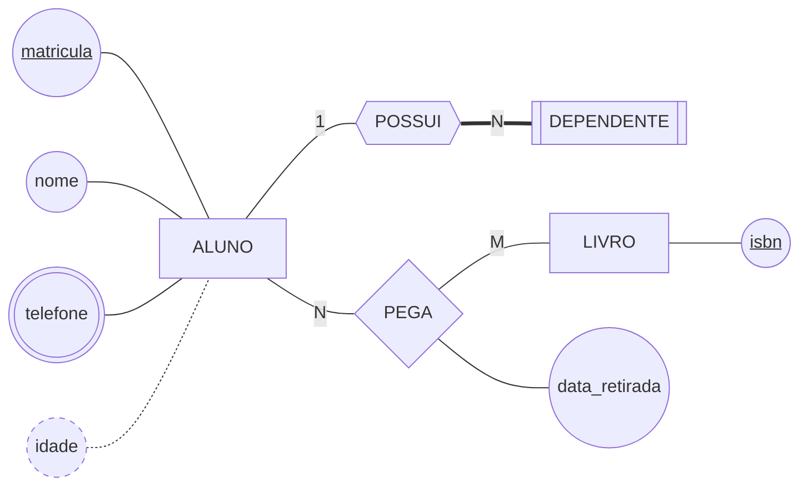
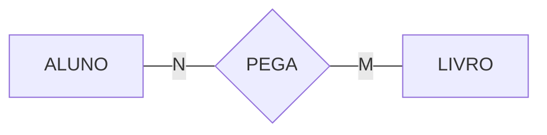
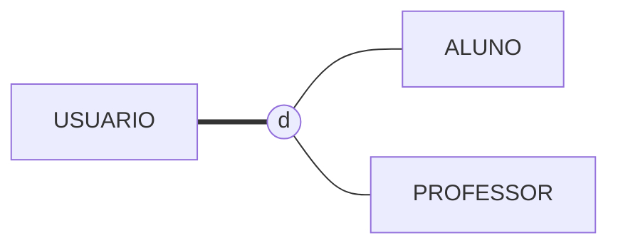

# 📐 Desenhando o DER na notação de Chen

Um mesmo modelo pode ser desenhado de várias formas. **Este curso usa uma só: a notação de Chen** — retângulo para entidade, losango para relacionamento, elipse para atributo.

São três formas geométricas para três conceitos, e é essa correspondência que faz o diagrama ser lido de longe: você reconhece o que é cada coisa pelo desenho, antes de ler o nome.

Você desenha em **Mermaid `flowchart`**, escrevendo texto. O GitHub renderiza sozinho, o diagrama versiona e faz *diff* de verdade, e cabe dentro de um Pull Request — coisa que imagem exportada não faz.

> 📖 É a notação do livro-base (Heuser) e a que a ementa do curso pede em *"Notação gráfica dos diagramas"*.

---

## 1. As formas

| Conceito | Forma em Chen | Como se escreve | Observação |
|---|---|---|---|
| Entidade | Retângulo | `ALUNO[ALUNO]` | |
| Entidade fraca | Retângulo duplo | `DEP[[DEPENDENTE]]` | depende de outra para existir |
| Relacionamento | Losango | `PEGA{PEGA}` | |
| Relacionamento identificador | Losango duplo | `POSSUI{{POSSUI}}` | **sai hexágono** — ver seção 4 |
| Atributo | Elipse | `nome((nome))` | |
| Atributo-chave | Elipse, nome sublinhado | `mat(("<u>matricula</u>"))` | |
| Atributo multivalorado | Elipse dupla | `tel(((telefone)))` | |
| Atributo derivado | Elipse tracejada | `idade((idade))` + `classDef` | calculado, não armazenado |
| Cardinalidade | Número na linha | `ALUNO ---\|N\| PEGA` | |
| Especialização | Círculo entre superclasse e subclasses | `USUARIO --- D(("d"))` | `d` disjunta · `o` sobreposta — ver seção 4 |
| Especialização total | Linha dupla até o círculo | `USUARIO === D(("d"))` | parcial usa linha simples |
| Participação total | Linha dupla | `POSSUI ===\|N\| DEP` | a entidade daquele lado não existe fora do relacionamento |

Repare que **o id do nó e o rótulo são coisas diferentes**: em `ALUNO[ALUNO]`, o primeiro `ALUNO` é o nome interno que você usa para ligar as linhas, e o que está entre colchetes é o que aparece desenhado.

---

## 2. O primeiro diagrama

Isto é o que você escreve:

````markdown

````

E isto é o que o GitHub mostra:


Três coisas para reparar: `data_retirada` está pendurada no **losango**, não numa entidade — porque a data só existe quando alguém pega um livro; `telefone` tem contorno duplo, porque uma pessoa tem vários; e `idade` está tracejada, porque não se guarda idade, se guarda data de nascimento e se calcula.

---

## 3. Cardinalidade: a armadilha do lado

O número fica na linha entre a entidade e o losango. E é aqui que quase todo mundo erra na primeira vez.



> ⚠️ **O número fica junto da entidade que ele conta.** O `N` encostado em `ALUNO` significa "N alunos participam", não "um aluno pega N livros". Leia sempre a frase inteira em voz alta: **N alunos pegam M livros**.

A regra cabe num desenho, e vale para todo diagrama deste curso:

```
   [EDITORA] ──1── {PUBLICA} ──N── [LIVRO]
    ↑                               ↑
    └─ "1 editora"                  └─ "N livros"
```

Os três casos que você vai usar o tempo todo:

| Escreve-se | Lê-se | Nome |
|---|---|---|
| `A ---\|1\| R` e `R ---\|1\| B` | um para um | **1:1** — desconfie, costuma ser uma entidade só |
| `A ---\|1\| R` e `R ---\|N\| B` | um para muitos | **1:N** — o caso mais comum de todos |
| `A ---\|N\| R` e `R ---\|M\| B` | muitos para muitos | **N:M** — repare que são letras **diferentes** |

> 💡 Quando alguém discutir se um relacionamento é 1:N ou N:M, faça as duas perguntas separadas, de cada lado: *"quantos?"* e *"pode zero?"*. A discussão acaba em dez segundos, e as respostas já são o diagrama.

**Participação total** é a linha dupla — `===`. Ela diz que a entidade **não pode existir fora** daquele relacionamento: todo dependente precisa de um aluno responsável, então do lado do dependente a linha é dupla.

---

## 4. Três coisas que o Mermaid não desenha direito

Melhor saber agora do que descobrir na véspera da entrega.

**O losango duplo não existe.** Para relacionamento identificador — aquele que dá identidade a uma entidade fraca — o Mermaid não tem a forma. **A convenção deste curso é o hexágono `{{ }}`**, como no `POSSUI` do diagrama da seção 2. No papel e na prova, desenhe o losango duplo normalmente; no Mermaid, hexágono.

**O atributo é um círculo, e ele incha.** Nomes longos como `data_retirada` viram círculos enormes e empurram o diagrama todo. A saída não é trocar a forma — a forma *é* o conceito, e um atributo desenhado como retângulo vira uma entidade aos olhos de quem lê.

**A especialização não tem símbolo.** Chen desenha um triângulo, ou um círculo com `d` (disjunta) ou `o` (sobreposta), entre a superclasse e as subclasses. O Mermaid não tem a forma, e **a convenção deste curso é o círculo com a letra dentro** — `D(("d"))` —, com a linha da superclasse até ele dupla quando a especialização é **total** e simples quando é **parcial**:



Esse desenho afirma: todo usuário é aluno **ou** professor (total, pela linha dupla), e nunca os dois ao mesmo tempo (disjunta, pelo `d`). Trocar o `d` por `o` permite ser os dois; trocar `===` por `---` permite não ser nenhum. As quatro combinações estão desenhadas no [exemplo da Aula 11](../bloco-3-abordagem-entidade-relacionamento/aula-11-especializacao-e-generalizacao/exemplos/especializacao-usuario.md).

> 📏 **Regra do curso:** desenhe **poucos atributos** por diagrama — a chave e mais dois ou três que importam para o assunto. Os demais vão numa lista em texto, abaixo do diagrama. Diagrama de DER serve para mostrar **estrutura**, não para ser o inventário completo das colunas.

E vale sempre: **todo diagrama vem seguido de um parágrafo em português dizendo o que ele afirma sobre o mundo.** O diagrama mostra a forma; o texto carrega o compromisso. Regra de negócio nunca cabe no desenho.

---

## 5. Pé-de-galinha em meia página — para ler a ferramenta

A outra notação que você vai encontrar se chama **pé-de-galinha** (*crow's foot*). Ela não é usada neste curso, mas é a que aparece em quase toda ferramenta de mercado — inclusive nas que você vai abrir no Bloco 3. Meia página basta para não se perder.

A diferença de fundo: no pé-de-galinha **não existe losango**. O relacionamento vira a própria linha entre as duas caixas, e os atributos vão para dentro da caixa, em vez de ficarem pendurados em elipses.

| Em Chen (este curso) | No pé-de-galinha |
|---|---|
| Retângulo com elipses em volta | Caixa com a lista de atributos dentro |
| Losango | A linha, com o nome escrito em cima |
| Elipse com nome sublinhado | Atributo marcado `PK` |
| Elipse dupla (multivalorado) | Não existe: vira outra caixa |
| Número `1`, `N`, `M` na linha | Símbolo encostado na caixa: `||`, `o{`, `|{` |
| Linha dupla (participação total) | O traço `|` do lado de dentro do símbolo |

> ⚠️ **O símbolo fica do mesmo lado nas duas notações — e é a `(min,max)` que inverte.** Em Chen, o `N` encostado em `ALUNO` fala sobre alunos; no pé-de-galinha, o pé-de-galinha encostado em `ALUNO` também fala sobre alunos, e a conversão é ponta por ponta. Quem troca o lado é a notação **`(min,max)`**, que aparece em parte da literatura e em algumas ferramentas: nela, o par escrito ao lado de uma entidade diz quantas vezes **cada ocorrência dela** participa do relacionamento, e o `(1,n)` acaba do lado que aqui recebe o `1`. Ao ler um diagrama de outra fonte, a primeira pergunta é sempre *"que convenção é esta?"* — e a resposta se confirma lendo uma linha em voz alta e conferindo se ela é verdade no mundo.

---

## 6. Escrevendo `flowchart` que renderiza de primeira

Os cinco tropeços que consomem a aula inteira:

1. **A cerca precisa dizer `mermaid`** — ```` ```mermaid ````, tudo minúsculo;
2. **Acento quebra no id, não no rótulo.** `MEDICO[MÉDICO]` funciona; `MÉDICO[MÉDICO]` não. Convenção do curso: id em `MAIUSCULO_COM_UNDERSCORE`, sem acento;
3. **`<u>` exige aspas em volta do rótulo** — `mat(("<u>matricula</u>"))`. Sem as aspas, não renderiza;
4. **`classDef` e `class` vêm no fim**, depois de todos os nós. Declarar antes não pega;
5. **Um nó por id.** Se `nome((nome))` aparece ligado a duas entidades, é o *mesmo* atributo em dois lugares. Use ids distintos: `nome_aluno((nome))` e `nome_livro((nome))`.

Para testar antes de commitar: cole em [mermaid.live](https://mermaid.live) ou abra o *preview* do Markdown no VS Code (`Cmd/Ctrl + Shift + V`). Se o bloco aparecer como código cru na página do GitHub, é erro de sintaxe — não é o GitHub que está fora do ar.

---

🏠 [Voltar ao início](../README.md)
