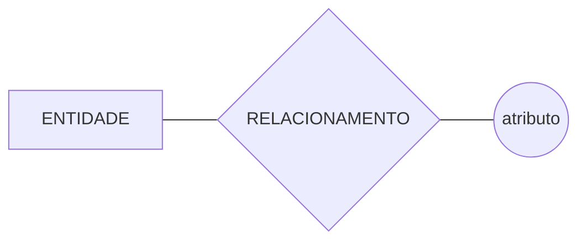
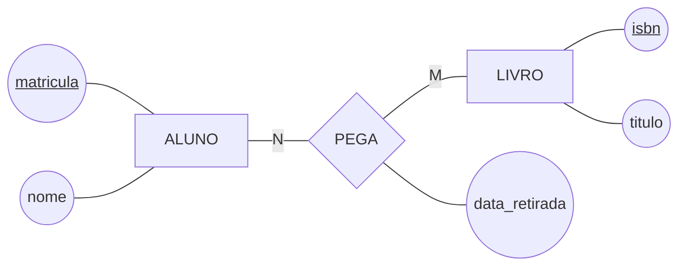
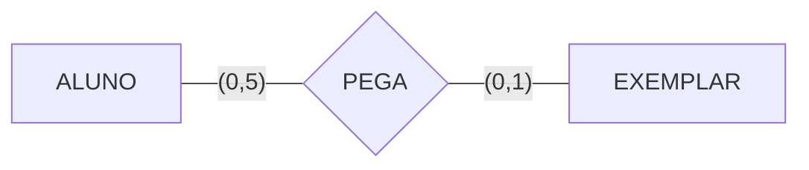
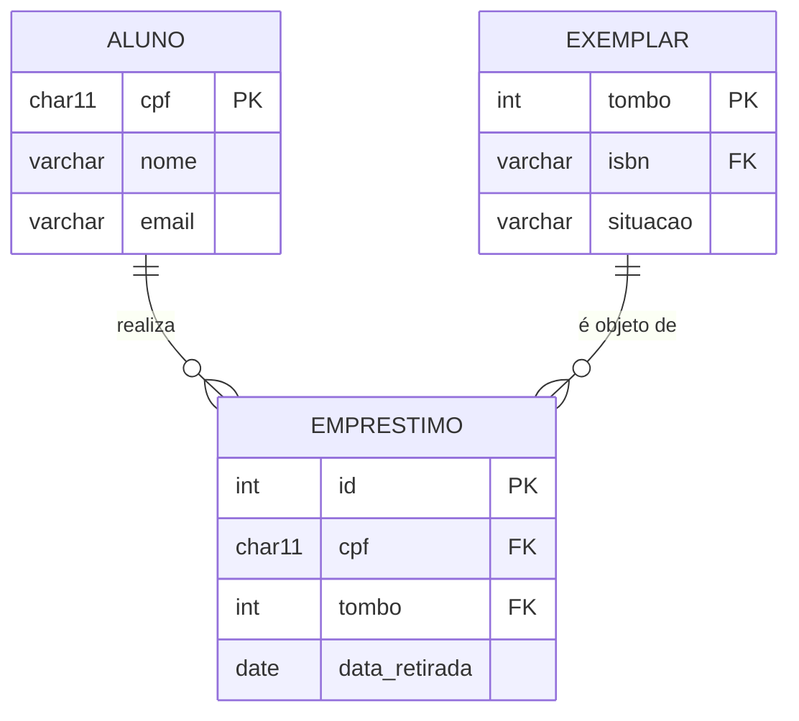
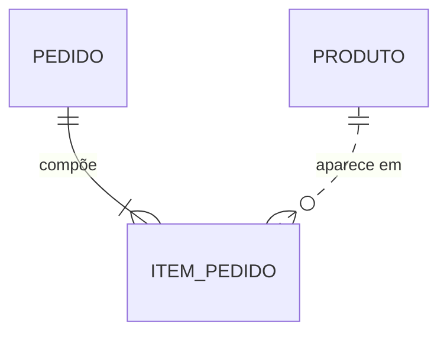

# 📐 Notações de DER em 10 minutos

Um mesmo modelo pode ser desenhado de várias formas. Este curso usa **duas**, e por motivos diferentes:

| Notação | Onde usamos | Por quê |
|---------|-------------|---------|
| **Chen** | No quadro, no papel e nas suas respostas escritas | É a notação do livro-base e a linguagem comum da teoria: separa visualmente entidade, relacionamento e atributo |
| **Mermaid `erDiagram`** | Nos arquivos `.md` do repositório | O GitHub renderiza sozinho, é texto puro (versiona e faz *diff* de verdade) e cabe dentro de um Pull Request |

Uma terceira, **pé-de-galinha** (*crow's foot*), você vai encontrar em toda ferramenta de mercado — Mermaid é uma variante dela. Vale reconhecer.

---

## 1. Chen — a notação da teoria

Três formas geométricas, três conceitos:



Um modelo completo em Chen:



### O vocabulário completo, e como escrevê-lo em Mermaid

Toda linha desta tabela renderiza no GitHub. É a razão de o curso desenhar Chen em `flowchart` e não em `erDiagram`: o `erDiagram` não tem losango nem elipse.

| Elemento | Como se desenha | Em Mermaid `flowchart` |
|---|---|---|
| Entidade forte | Retângulo simples | `ALUNO[ALUNO]` |
| Entidade fraca | Retângulo de **linha dupla** | `DEPENDENTE[[DEPENDENTE]]` |
| Relacionamento | Losango | `PEGA{PEGA}` |
| Relacionamento identificador | Losango de **linha dupla** | `POSSUI{{POSSUI}}` |
| Atributo | Elipse ligada à entidade | `nome((nome))` |
| Atributo-chave | Elipse com o nome **sublinhado** | `id(("<u>id</u>"))` |
| Atributo parcial (de entidade fraca) | Nome com **sublinhado tracejado** | `n(("<i>numero</i>"))` + nota em texto |
| Atributo multivalorado | Elipse de **linha dupla** | `tel(((telefone)))` |
| Atributo derivado | Elipse **tracejada** | `idade((idade))` + nota `derivado de …` |
| Atributo composto | Elipses filhas penduradas na elipse-mãe | `end((endereco)) --- rua((rua))` |
| Cardinalidade | Número junto à linha | `ALUNO ---\|N\| PEGA` |
| Participação total | **Linha dupla** entre entidade e relacionamento | `ALUNO ===\|1\| PEGA` |
| Participação parcial | Linha simples | `ALUNO ---\|1\| PEGA` |
| Especialização | Triângulo com **d** (disjunta) ou **o** (sobreposta) | `USUARIO --- d{d} --- ALUNO` + nota em texto |

> 💡 Duas coisas o `flowchart` não desenha: a elipse **tracejada** do atributo derivado e o **sublinhado tracejado** da chave parcial. Nos dois casos, use a forma simples e diga em texto — a mesma regra da seção 4.

> ⚠️ **A cardinalidade em Chen fica do lado "errado" para muita gente.** O `N` escrito perto de `ALUNO` significa *"N alunos participam"*, e não *"um aluno pega N livros"*. Leia sempre a frase inteira em voz alta: **N alunos pegam M livros**.

---

## 2. Notação (min,max) — a que não deixa dúvida

Escreve os dois números junto de cada lado: **(mínimo, máximo) de participações de UMA instância daquela entidade**.



Lê-se: um aluno pega de 0 a 5 exemplares; um exemplar é pego por 0 ou 1 aluno.

E aqui está o ganho: o **mínimo** codifica a participação e o **máximo** codifica a cardinalidade, tudo no mesmo par.

| Par | Significado |
|:---:|---|
| `(0,1)` | Participação **parcial**, no máximo um |
| `(1,1)` | Participação **total**, exatamente um |
| `(0,N)` | Participação parcial, vários |
| `(1,N)` | Participação **total**, pelo menos um |

> 💡 Quando alguém discutir se um relacionamento é 1:N ou N:M, peça o `(min,max)` dos dois lados. A discussão acaba em dez segundos.

---

## 3. Mermaid `erDiagram` — a notação que versiona

O mesmo modelo do item 1, em texto:

````markdown

````

Que o GitHub renderiza assim:


### A tabela de conversão que você vai consultar sempre

O símbolo tem duas metades: a **de fora** diz o máximo, a **de dentro** diz o mínimo.

| Mermaid | Lê-se | Chen equivalente |
|---------|-------|------------------|
| `\|\|--\|\|` | um e apenas um ↔ um e apenas um | 1:1, participação total dos dois lados |
| `\|\|--o{` | um ↔ zero ou vários | 1:N, parcial do lado N |
| `\|\|--\|{` | um ↔ um ou vários | 1:N, **total** do lado N |
| `\|o--o{` | zero ou um ↔ zero ou vários | 1:N, parcial dos dois lados |
| `}o--o{` | zero ou vários ↔ zero ou vários | N:M |
| `}\|--\|{` | um ou vários ↔ um ou vários | N:M, total dos dois lados |

Memorize as quatro peças e você monta qualquer combinação:

| Peça | Mínimo | Máximo |
|:---:|:---:|:---:|
| `\|\|` | 1 | 1 |
| `\|o` | 0 | 1 |
| `}\|` | 1 | N |
| `}o` | 0 | N |

> ⚠️ **Do lado esquerdo, o símbolo vem espelhado.** Escreve-se `||--o{`, nunca `||--{o`. Se o diagrama não renderizar, este é o primeiro suspeito.

### Linha sólida × tracejada

- `--` **relacionamento identificador** — use quando a entidade da direita é **fraca** e depende da esquerda para existir;
- `..` **relacionamento não identificador** — o caso comum.



`ITEM_PEDIDO` é fraco em relação a `PEDIDO` (linha sólida: sem pedido, não existe item), mas apenas referencia `PRODUTO` (linha tracejada).

---

## 4. O que o Mermaid **não** desenha

Nem toda a expressividade de Chen cabe no `erDiagram`. Quando faltar símbolo, **escreva em texto abaixo do diagrama** — perder a informação é pior que perder a beleza:

| Conceito | Como registrar no seu `.md` |
|---|---|
| Atributo multivalorado | Não existe. Já modele como entidade separada e comente o porquê |
| Atributo derivado | Comentário na linha do atributo: `int idade "derivado de data_nascimento"` |
| Atributo composto | Achate em vários atributos (`end_rua`, `end_numero`) e diga que formam `endereco` |
| Especialização | Um relacionamento `\|\|--\|\|` de cada subclasse para a superclasse, mais uma nota `> Especialização disjunta e total.` |
| Agregação | Não existe. Descreva em texto qual relacionamento foi tratado como entidade |
| Relacionamento ternário | Não existe. Modele a entidade associativa e explique que ela representa um ternário |

> 📏 **Regra do curso:** todo diagrama Mermaid vem seguido de um parágrafo em português dizendo **o que ele afirma sobre o mundo**. O diagrama mostra a forma; o texto carrega o compromisso.

---

## 5. Escrevendo Mermaid que renderiza de primeira

Os cinco tropeços que consomem a aula inteira:

1. **A cerca precisa dizer `mermaid`** — ```` ```mermaid ````, tudo minúsculo;
2. **O rótulo do relacionamento é obrigatório** — `ALUNO ||--o{ EMPRESTIMO : "realiza"`. Sem os dois-pontos e o texto, não renderiza. Se não souber o nome, use `: ""`;
3. **Nome de entidade não aceita espaço nem acento** — use `ITEM_PEDIDO`, não `Item Pedido`. Convenção do curso: `MAIUSCULO_COM_UNDERSCORE`;
4. **Tipo de atributo não aceita parênteses** — `varchar(50)` quebra. Escreva `varchar nome` e ponha o tamanho no comentário: `varchar nome "50 caracteres"`;
5. **Chaves são `PK`, `FK`, `UK`** — maiúsculas, depois do nome do atributo, nessa ordem: `tipo nome CHAVE "comentário"`.

Para testar antes de commitar: cole no [mermaid.live](https://mermaid.live) ou abra o *preview* do Markdown no VS Code (`Cmd/Ctrl + Shift + V`).

---

🏠 [Voltar ao início](../README.md)
