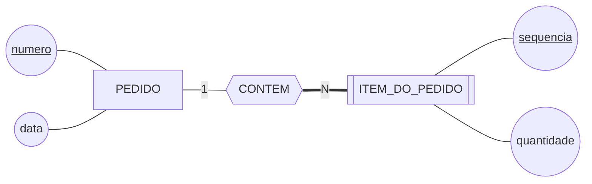
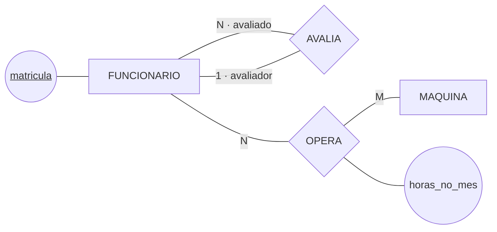

# Revisão geral — Aulas 01 a 06

### R-01

A planilha de empréstimos guarda, na mesma linha, o aluno, o livro e o empréstimo. Dela saem os três problemas da Aula 01: não há onde cadastrar livro novo, mudar o nome do aluno exige alterar várias linhas, e apagar um empréstimo faz sumir o livro. Segundo a aula, a causa comum aos três é que:

- **a)** a planilha não tem um programa que verifique as regras antes de gravar;
- **b)** ela guarda coisas de naturezas diferentes na mesma linha;
- **c)** os dados estão repetidos, e repetição sempre produz erro de digitação;
- **d)** falta um SGBD, que eliminaria a redundância automaticamente.

↩︎ *Aula 01, seções 3 e 7 — As três anomalias; O que o SGBD não resolve sozinho*

---

### R-02

Tanto o modelo de rede quanto o relacional resolvem o caso do aluno que cursa duas turmas sem duplicar o aluno. Segundo a aula, o que o relacional resolveu **e o de rede não**, foi:

- **a)** guardar cada dado uma vez só, em vez de repeti-lo em vários arquivos;
- **b)** permitir que um registro tivesse mais de um pai na estrutura;
- **c)** abrir mão de garantias para conseguir distribuir os dados em muitas máquinas;
- **d)** tirar o caminho até o dado de dentro do programa: pede-se *o que*, e o SGBD decide *como*.

↩︎ *Aula 02, seções 2 e 3 — Hierárquico e rede; 1970: Codd e o modelo relacional*

---

### R-03

Numa biblioteca, `SITUACAO` tem quatro valores fixos e nada além da descrição. Num cadastro de pessoas, de cada `TELEFONE` interessam o tipo, o horário de contato e quem atendeu. Segundo a aula:

- **a)** `SITUACAO` é atributo e `TELEFONE` é entidade — o que decide é o que se quer guardar sobre cada um;
- **b)** as duas são atributos, porque nenhuma delas existe fisicamente como objeto;
- **c)** as duas são entidades, porque ambas se distinguem umas das outras;
- **d)** `SITUACAO` é entidade e `TELEFONE` é atributo multivalorado, como sempre.

↩︎ *Aula 03, seções 2, 3 e 4 — Entidade: o que merece ser uma; Atributo e seus tipos; O que não é entidade*

---

### R-04

Uma equipe levantou requisitos só por entrevista e entregou o modelo. Meses depois descobriu-se que o bibliotecário anota no campo "observação" do formulário quando o livro volta danificado — uma regra de negócio inteira que ninguém tinha mencionado. Segundo a aula, isso aconteceu porque:

- **a)** a entrevista é a pior das quatro fontes e não deveria ter sido usada sozinha;
- **b)** o formulário estava desatualizado, e documentos antigos escondem campos que já não se usam;
- **c)** cada fonte esconde algo diferente, e a entrevista não alcança a rotina que já virou automática para quem a executa;
- **d)** o sistema legado deveria ter sido consultado, por ser a única fonte com comportamento testado.

↩︎ *Aula 04, seção 2 — De onde vêm os requisitos*

---

### R-05

O banco analítico da biblioteca repete o nome do curso do aluno em milhões de linhas, de propósito. Segundo a aula, isso é legítimo ali e seria erro no banco do balcão porque:

- **a)** o banco analítico é menor, e a repetição custa pouco espaço nele;
- **b)** repetir só faz mal onde o dado muda, e no banco analítico ele entra por carga programada e nunca é corrigido depois;
- **c)** bancos analíticos usam outro SGBD, que trata a repetição de forma diferente;
- **d)** o banco do balcão não tem relatórios, e por isso não precisa de dado repetido.

↩︎ *Aula 04, seções 5 e 6 — OLAP — o banco que analisa; Cenários e a convivência*

---

### R-06

No conceitual, um aluno pode se inscrever em várias oficinas e uma oficina recebe vários alunos; interessa a data de cada inscrição. Um empréstimo, por sua vez, pertence a um único aluno. Segundo a aula, no modelo lógico:

- **a)** os dois viram uma coluna a mais na tabela do lado N;
- **b)** os dois viram uma tabela nova, porque todo relacionamento vira tabela;
- **c)** a inscrição vira tabela nova, com a data dentro dela; o empréstimo vira uma coluna a mais no lado N;
- **d)** a inscrição vira uma coluna com a lista de oficinas, e o empréstimo vira tabela nova.

↩︎ *Aula 05, seção 4 — O modelo lógico: como isso vira tabela*

---

### R-07

Você vai à reunião com a bibliotecária para validar o projeto. Segundo a aula, o documento que faz sentido levar, e o motivo:

- **a)** o modelo conceitual, porque é o único que ela consegue conferir — ela sabe dizer se um empréstimo pode ter dois alunos;
- **b)** o modelo lógico, porque as tabelas mostram exatamente o que será construído;
- **c)** o modelo físico, porque é onde estão os tipos e os índices que afetam o uso diário;
- **d)** os três juntos, porque cada um responde a uma parte da pergunta dela.

↩︎ *Aula 05, seções 3 e 6 — O modelo conceitual — o que o mundo é; Por que a ordem não se inverte*

---

### R-08

Observe o diagrama de uma loja:

O que este diagrama afirma?

- **a)** que todo pedido precisa ter pelo menos um item, porque a linha do lado do item é dupla;
- **b)** que `ITEM_DO_PEDIDO` é fraca porque depende do pedido, mas a `sequencia` sozinha já a identifica;
- **c)** que o relacionamento `CONTEM` é N:M, porque tem um `N` escrito nele;
- **d)** que `ITEM_DO_PEDIDO` é fraca e só se identifica pelo par `(numero, sequencia)`, e que item nenhum existe fora de um pedido.

↩︎ *Aula 06, seções 2 e 5 — Entidade forte e entidade fraca; Participação: pode zero?*

---

### R-09

Observe o diagrama de uma fábrica:

Sobre `horas_no_mes` e sobre os rótulos do `AVALIA`, o diagrama afirma que:

- **a)** as horas são um atributo do funcionário, e os rótulos nomeiam duas entidades diferentes;
- **b)** as horas pertencem ao par funcionário–máquina, e os rótulos dizem em que qualidade cada ponta participa;
- **c)** as horas pertencem à máquina, e os rótulos podem ser omitidos sem perda;
- **d)** as horas são derivadas, e `avaliador` deveria ser uma entidade própria.

↩︎ *Aula 06, seções 3 e 6 — O relacionamento e o que mora dentro dele; O relacionamento de uma entidade com ela mesma*

---

### R-10 — modelagem

> Uma gráfica registra seus **pedidos**. De cada pedido interessam o número, a data de entrada e o nome do cliente.
>
> Cada pedido tem **itens**, numerados de 1 em diante **dentro do próprio pedido** — dois pedidos diferentes podem ter itens com o mesmo número. De cada item interessam a descrição do serviço e a quantidade. Nenhum item existe fora de um pedido, e nenhum pedido é registrado sem ao menos um item.
>
> A gráfica tem **funcionários**, identificados pela matrícula, com nome e função. Alguns funcionários revisam o trabalho de outros: quem revisa acompanha vários colegas, e cada funcionário é revisado por no máximo um. De cada revisão a gráfica registra **desde quando** ela vale.

Faça o modelo conceitual. Para cada entidade, dê os atributos e o identificador; para cada relacionamento, a cardinalidade e a participação dos dois lados; no autorrelacionamento, o papel de cada ponta.

↩︎ *Aulas 03 e 06 — é o percurso de [`resolvendo-um-enunciado.md`](../bloco-2-modelos-de-banco-de-dados/aula-06-notacao-e-tipos-de-entidade/exemplos/resolvendo-um-enunciado.md)*

---

⬅️ [Voltar ao plano de aulas](../README.md)
